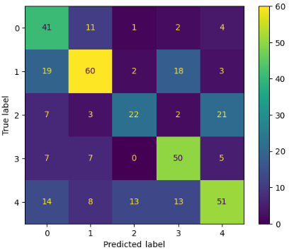
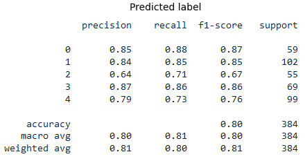
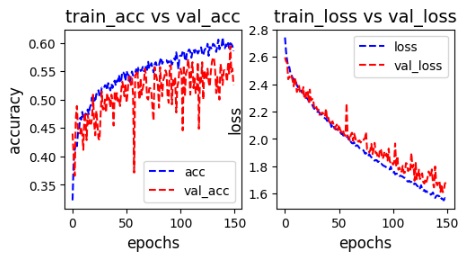
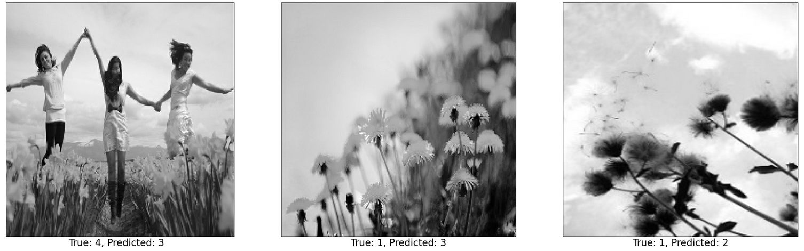

# CS4341_Project2 Write Up
Image classification using machine learning

### Model & Training Procedure Description 
1. Test 1
    - Data preprocessing implementation (i.e, shuffle or rotate data) : 
        1) Flips -> Random flip horizontal 
        2) Rotations -> random rotation of 0.3
    - ANN architectures (i.e, number of layers, number of neurons in each layer, type of activation function) :
        1) Number of Layers -> 22 layers
        2) Number of Neurons by Layer 
        - 1 x input layer
        - 1 x rescaling layer

        - 2 x convolution layer of 64 channel of 3x3 kernel and same padding.
        - 1 x maxpool layer of 2x2 pool size and stride 2x2.
        - 2 x convolution layer of 128 channel of 3x3 kernel and same padding.
        - 1 x maxpool layer of 2x2 pool size and stride 2x2.
        - 3 x convolution layer of 256 channel of 3x3 kernel and same padding.
        - 1 x maxpool layer of 2x2 pool size and stride 2x2.
        - 3 x convolution layer of 512 channel of 3x3 kernel and same padding.
        - 1 x maxpool layer of 2x2 pool size and stride 2x2.
        - 3 x convolution layer of 512 channel of 3x3 kernel and same padding.
        - 1 x maxpool layer of 2x2 pool size and stride 2x2.

        - 1 x Dense layer of 224 units with ReLU activation function
        - 1 x Dense Softmax layer of 5 units.

        3) Activation Function* 
        - All convolutional layers utilize the ReLU activation function
    - Hyper-parameter value selection (i.e, the reshaped input image size, the type of optimizer, training epochs, and number of neurons or hidden_size or number of parameters, the loss function) :
        1) Number of Training Epochs -> 10 Epochs
        2) Reshaped Image Size -> (224, 224)
        3) Type of Optimizer -> Utilized the 'adam' optimizer
        4) Number of Neurons -> 224 hidden units
        5) Loss Function -> 'SparseCategoricalCrossentropy'
    - Accuracy you obtained in each of these experiments on the test set : 
        1) 24.06%

2. Test 2
    - Data preprocessing implementation (i.e, shuffle or rotate data) : 
        1) Flip -> Random flip horizontal 
        2) Rotations -> random rotation of 0.3
    - ANN architectures (i.e, number of layers, number of neurons in each layer, type of activation function) :
        1) Number of Layers -> 14 layers
        2) Number of Neurons by Layer 
        - 1 x input layer
        - 1 x rescaling layer

        - 1 x convolution layer of 32 channel of 3x3 kernel and same padding.
        - 1 x convolution layer of 64 channel of 3x3 kernel and same padding.
        - 1 x maxpool layer of 2x2 pool size and stride 2x2.
        - 1 x convolution layer of 64 channel of 3x3 kernel and same padding.
        - 1 x convolution layer of 128 channel of 3x3 kernel and same padding.
        - 1 x maxpool layer of 2x2 pool size and stride 2x2.
        - 1 x convolution layer of 128 channel of 3x3 kernel and same padding.
        - 1 x convolution layer of 256 channel of 3x3 kernel and same padding.
        - 1 x maxpool layer of 2x2 pool size and stride 2x2.
        - 1 x convolution layer of 256 channel of 3x3 kernel and same padding.
        - 1 x maxpool layer of 2x2 pool size and stride 2x2.

        - 1 x Dense layer of 224 units with ReLU activation function
        - 1 x Dense Softmax layer of 5 units.

        3) Activation Function 
        - All convolutional layers utilize the ReLU activation function
    - Hyper-parameter value selection (i.e, the reshaped input image size, the type of optimizer, training epochs, and number of neurons or hidden_size or number of parameters, the loss function) :
        1) Number of Training Epochs -> 20 Epochs
        2) Reshaped Image Size -> (224, 224)
        3) Type of Optimizer -> Utilized the 'adam' optimizer
        4) Number of Neurons -> 224 hidden units
        5) Loss Function -> 'SparseCategoricalCrossentropy'
    - Accuracy you obtained in each of these experiments on the test set : 
        1) 68.3%

3. Test 3
    - Data preprocessing implementation (i.e, shuffle or rotate data) : 
        1) Flip -> Random flip horizontal 
        2) Rotations -> random rotation of 0.3
    - ANN architectures (i.e, number of layers, number of neurons in each layer, type of activation function) :
        1) Number of Layers -> 16 layers
        2) Number of Neurons by Layer:
        - 1 x input layer
        - 1 x rescaling layer

        - 2 x convolution layer of 32 channel of 3x3 kernel and same padding.
        - 1 x maxpool layer of 2x2 pool size and stride 2x2.
        - 2 x convolution layer of 64 channel of 3x3 kernel and same padding.
        - 1 x maxpool layer of 2x2 pool size and stride 2x2.
        - 2 x convolution layer of 128 channel of 3x3 kernel and same padding.
        - 1 x maxpool layer of 2x2 pool size and stride 2x2.
        - 1 x convolution layer of 256 channel of 3x3 kernel and same padding.
        - 1 x maxpool layer of 2x2 pool size and stride 2x2.

        - 1 x Dense layer of 224 units with ReLU activation function
        - 1 x Dense Softmax layer of 5 units.

        3) Activation Function: 
        - All convolutional layers utilize the ReLU activation function
    - Hyper-parameter value selection (i.e, the reshaped input image size, the type of optimizer, training epochs, and number of neurons or hidden_size or number of parameters, the loss function) :
        1) Number of Training Epochs -> 19 Epochs
        2) Reshaped Image Size -> (224, 224)
        3) Type of Optimizer -> Utilized the 'adam' optimizer
        4) Number of Neurons -> 224 hidden units
        5) Loss Function -> 'SparseCategoricalCrossentropy'
    - Accuracy you obtained in each of these experiments on the test set : 
        1) 75.2%

4. Additional tests
    *The following results used these preprocessing settings*

    - Flip -> horizontal and vertical flip
    - Zoom -> random zoom (0.2, 0.2)
    - Rotations -> random rotation (0.3)
    - Shuffling -> shuffle with buffer_size 5000

    1) 224 unit dense layer with sigmoid + 20 epochs -> 77%
    2) 224 unit dense layer with sigmoid + 30 epochs -> 74.7%
    3) 224 unit dense layer with sigmoid + 50 epochs -> 77.8%
    4) 224 unit dense layer with sigmoid and relu each + 20 epochs -> 75%
    5) 224 unit dense layer with sigmoid and relu each + 50 epochs -> 72% (badly overfitting)

5. Final Model
    - Data preprocessing implementation (i.e, shuffle or rotate data)
        1) Flip -> Random flip horizontal and vertical 
        2) Shuffling -> utilize shuffle() with a buffer size of 5000
        3) Rotations -> random rotation of 0.25
        4) Zoom -> Random zoom of (0.2, 0.2)
    - ANN architectures (i.e, number of layers, number of neurons in each layer, type of activation function)
        1) Number of Layers* -> 16 layers
        2) Number of Neurons by Layer: 
            - 2 x convolution layer of 32 channel of 3x3 kernel and same padding.
            - 1 x maxpool layer of 2x2 pool size and stride 2x2.
            - 2 x convolution layer of 64 channel of 3x3 kernel and same padding.
            - 1 x maxpool layer of 2x2 pool size and stride 2x2.
            - 2 x convolution layer of 128 channel of 3x3 kernel and same padding.
            - 1 x maxpool layer of 2x2 pool size and stride 2x2.
            - 1 x convolution layer of 256 channel of 3x3 kernel and same padding.

            - 1 x Dense layer of 224 units using sigmoid activation function.
            - 1 x Dense Softmax layer of 5 units.
        3)Activation Function 
            - The first dense layer utilizes the Sigmoid activation function
            - All convolutional layers utilize the ReLU activation function
    - Hyper-parameter value selection (i.e, the reshaped input image size, the type of optimizer, training epochs, and number of neurons or hidden_size or number of parameters, the loss function)
        1) Number of Training Epochs -> 70 Epochs
        2) Reshaped Image Size -> (224, 224)
        3) Type of Optimizer -> Utilized the 'adam' optimizer
        4) Number of Neurons -> 224 hidden units
        5) Loss Function -> 'SparseCategoricalCrossentropy'
    - Accuracy you obtained in each of these experiments on the test set : 
        1) 75.2%

### Model Performance & Confusion Matrix 
1. Final Model Details
    - Data preprocessing implementation (i.e, shuffle or rotate data)
        1) Flip -> Random flip horizontal and vertical 
        2) Shuffling -> utilize shuffle() with a buffer size of 5000
        3) Rotations -> random rotation of 0.25
        4) Zoom -> Random zoom of (0.2, 0.2)
    - ANN architectures (i.e, number of layers, number of neurons in each layer, type of activation function)
        1) Number of Layers* -> 16 layers
        2) Number of Neurons by Layer: 
            - 2 x convolution layer of 32 channel of 3x3 kernel and same padding.
            - 1 x maxpool layer of 2x2 pool size and stride 2x2.
            - 2 x convolution layer of 64 channel of 3x3 kernel and same padding.
            - 1 x maxpool layer of 2x2 pool size and stride 2x2.
            - 2 x convolution layer of 128 channel of 3x3 kernel and same padding.
            - 1 x maxpool layer of 2x2 pool size and stride 2x2.
            - 1 x convolution layer of 256 channel of 3x3 kernel and same padding.

            - 1 x Dense layer of 224 units using sigmoid activation function.
            - 1 x Dense Softmax layer of 5 units.
        3)Activation Function 
            - The first dense layer utilizes the Sigmoid activation function
            - All convolutional layers utilize the ReLU activation function
    - Hyper-parameter value selection (i.e, the reshaped input image size, the type of optimizer, training epochs, and number of neurons or hidden_size or number of parameters, the loss function)
        1) Number of Training Epochs -> 70 Epochs
        2) Reshaped Image Size -> (224, 224)
        3) Type of Optimizer -> Utilized the 'adam' optimizer
        4) Number of Neurons -> 224 hidden units
        5) Loss Function -> 'SparseCategoricalCrossentropy'
    - Accuracy you obtained in each of these experiments on the test set : 
        1) 75.2%

Include a confusion matrix, showing the results of testing the model on the test set. The matrix should be a 5-by-5 grid showing which categories of images were classified. Use your confusion matrix to additionally report precision and recall for each of the 5 classes, as well as the overall accuracy of your model.  

### Training Performance Plot  

### Visualization 

Include 3 visualizations of images that were misclassified by your best-performing model and any observations about why you think these images were misclassified by your model. You will have to create or use a visualization program that takes a 30-by-30 matrix input and translate it into a black-and-white image. 

1. Image 1
2. Image 2
3. Image 3