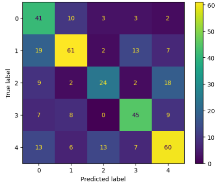
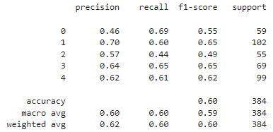

# CS4341_Project2 Write Up
Image classification using machine learning

# Model & Training Procedure Description

## Fully Connected Neural Network
1. Test 1
    - Data preprocessing
        1. Flip -> Random flip horizontal and vertical
        2. Rotation -> Random rotation of 0.15
        3. Zoom -> Random zoom of -0.15 to 0 for both width and height
        4. Translation -> Random translation of -0.15 to 0.15 for both width and height
    - ANN architectures (i.e, number of layers, number of neurons in each layer, type of activation function) :
        1. Number of layers -> 5
        2. Number of neurons by layer
            
                 1 x input layer
                 1 x rescaling layer
                 1 x Flatten layer
                
                 1 x Dense layer of 224 units with ReLu
                 1 x Dense Softmax layer of 5 units

        3. Activation Function* 
        - All convolutional layers utilize the ReLU activation function
    - Hyper-parameter value selection (i.e, the reshaped input image size, the type of optimizer, training epochs, and number of neurons or hidden_size or number of parameters, the loss function) :
        1. Number of Training Epochs -> 50 Epochs
        2. Reshaped Image Size -> (224, 224)
        3. Type of Optimizer -> Utilized the 'adam' optimizer
        4. Number of Neurons -> 229 hidden units
        5. Loss Function -> 'SparseCategoricalCrossentropy'
    - Accuracy you obtained in each of these experiments on the test set : **40.3%**            

2. Test 2
    - Data preprocessing
        1. Flip -> Random flip horizontal and vertical
        2. Rotation -> Random rotation of 0.15
        3. Zoom -> Random zoom of -0.15 to 0 for both width and height
        4. Translation -> Random translation of -0.15 to 0.15 for both width and height
    - ANN architectures (i.e, number of layers, number of neurons in each layer, type of activation function) :
        1. Number of layers -> 7
        2. Number of neurons by layer
            
                 1 x input layer
                 1 x rescaling layer
                 1 x Flatten layer
                
                 1 x Dense layer of 64 units with ReLu
                 1 x Dense layer of 32 units with ReLu
                 1 x Dense layer of 16 units with ReLu
                 1 x Dense Softmax layer of 5 units

            3. Activation Function* 
            - All convolutional layers utilize the ReLU activation function
    - Hyper-parameter value selection (i.e, the reshaped input image size, the type of optimizer, training epochs, and number of neurons or hidden_size or number of parameters, the loss function) :
        1. Number of Training Epochs -> 100 Epochs
        2. Reshaped Image Size -> (30, 30)
        3. Type of Optimizer -> Utilized the 'adam' optimizer
        4. Number of Neurons -> 117 hidden units
        5. Loss Function -> 'SparseCategoricalCrossentropy'
    - Accuracy you obtained in each of these experiments on the test set : **45.4%**

3. Test 3
    - Data preprocessing (same as previous)
    - ANN architectures (i.e, number of layers, number of neurons in each layer, type of activation function) :
        1. Number of layers -> 9
        2. Number of neurons by layer
            
                 1 x input layer
                 1 x rescaling layer
                 1 x Flatten layer

                 1 x Dense layer of 2048 units with ReLu
                 1 x Dense layer of 1024 units with ReLu
                 1 x Dense layer of 1024 units with ReLu
                 1 x Dense layer of 512 units with ReLu
                 1 x Dense layer of 128 units with ReLu (kernel_regularizer=l2(0.003))
                 1 x Dense Softmax layer of 5 units

        3. Activation Function* 
        - All convolutional layers utilize the ReLU activation function
    - Hyper-parameter value selection (i.e, the reshaped input image size, the type of optimizer, training epochs, and number of neurons or hidden_size or number of parameters, the loss function) :
        1. Number of Training Epochs -> 100 Epochs
        2. Reshaped Image Size -> (60, 60)
        3. Type of Optimizer -> Utilized the 'sgd' optimizer
        4. Number of Neurons -> 4741 hidden units
        5. Loss Function -> 'SparseCategoricalCrossentropy'
    - Accuracy you obtained in each of these experiments on the test set : **56.3%**

4. Best Model
    - Data preprocessing (same as previous)
    - ANN architectures (i.e, number of layers, number of neurons in each layer, type of activation function) :
        1. Number of layers -> 9
        2. Number of neurons by layer
            
                 1 x input layer
                 1 x rescaling layer
                 1 x Flatten layer

                 1 x Dense layer of 4096 units with ReLu
                 1 x Dense layer of 2048 units with ReLu
                 1 x Dense layer of 2048 units with ReLu
                 1 x Dense layer of 512 units with ReLu
                 1 x Dense layer of 128 units with ReLu (kernel_regularizer=l2(0.003))
                 1 x Dense Softmax layer of 5 units

        3. Activation Function* 
        - All convolutional layers utilize the ReLU activation function
    - Hyper-parameter value selection (i.e, the reshaped input image size, the type of optimizer, training epochs, and number of neurons or hidden_size or number of parameters, the loss function) :
        1. Number of Training Epochs -> 150 Epochs
        2. Reshaped Image Size -> (60, 60)
        3. Type of Optimizer -> Utilized the 'sgd' optimizer
        4. Number of Neurons -> 8837 hidden units
        5. Loss Function -> 'SparseCategoricalCrossentropy'
    - Accuracy you obtained in each of these experiments on the test set : **58.3%**

## Convolutional Neural Network (Additional experiments)
1. Test 1 (CNN)
    - Data preprocessing implementation (i.e, shuffle or rotate data) : 
        1. Flips -> Random flip horizontal 
        2. Rotations -> random rotation of 0.3
    - ANN architectures (i.e, number of layers, number of neurons in each layer, type of activation function) :
        1. Number of Layers -> 22 layers
        2. Number of Neurons by Layer 
            
                 1 x input layer
                 1 x rescaling layer
                 1 x Flatten layer

                 2 x convolution layer of 64 channel of 3x3 kernel and same padding.
                 1 x maxpool layer of 2x2 pool size and stride 2x2.
                 2 x convolution layer of 128 channel of 3x3 kernel and same padding.
                 1 x maxpool layer of 2x2 pool size and stride 2x2.
                 3 x convolution layer of 256 channel of 3x3 kernel and same padding.
                 1 x maxpool layer of 2x2 pool size and stride 2x2.
                 3 x convolution layer of 512 channel of 3x3 kernel and same padding.
                 1 x maxpool layer of 2x2 pool size and stride 2x2.
                 3 x convolution layer of 512 channel of 3x3 kernel and same padding.
                 1 x maxpool layer of 2x2 pool size and stride 2x2.

                 1 x Dense layer of 224 units with ReLU activation function
                 1 x Dense Softmax layer of 5 units.

        3. Activation Function* 
        - All convolutional layers utilize the ReLU activation function
    - Hyper-parameter value selection (i.e, the reshaped input image size, the type of optimizer, training epochs, and number of neurons or hidden_size or number of parameters, the loss function) :
        1. Number of Training Epochs -> 10 Epochs
        2. Reshaped Image Size -> (224, 224)
        3. Type of Optimizer -> Utilized the 'adam' optimizer
        4. Number of Neurons -> 229 hidden units
        5. Loss Function -> 'SparseCategoricalCrossentropy'
    - Accuracy you obtained in each of these experiments on the test set : **24.06%**

2. Test 2 (CNN)
    - Data preprocessing implementation (i.e, shuffle or rotate data) : 
        1. Flip -> Random flip horizontal 
        2. Rotations -> random rotation of 0.3
    - ANN architectures (i.e, number of layers, number of neurons in each layer, type of activation function) :
        1. Number of Layers -> 14 layers
        2. Number of Neurons by Layer 
            
                 1 x input layer
                 1 x rescaling layer
                 1 x Flatten layer

                 1 x convolution layer of 32 channel of 3x3 kernel and same padding.
                 1 x convolution layer of 64 channel of 3x3 kernel and same padding.
                 1 x maxpool layer of 2x2 pool size and stride 2x2.
                 1 x convolution layer of 64 channel of 3x3 kernel and same padding.
                 1 x convolution layer of 128 channel of 3x3 kernel and same padding.
                 1 x maxpool layer of 2x2 pool size and stride 2x2.
                 1 x convolution layer of 128 channel of 3x3 kernel and same padding.
                 1 x convolution layer of 256 channel of 3x3 kernel and same padding.
                 1 x maxpool layer of 2x2 pool size and stride 2x2.
                 1 x convolution layer of 256 channel of 3x3 kernel and same padding.
                 1 x maxpool layer of 2x2 pool size and stride 2x2.

                 1 x Dense layer of 224 units with ReLU activation function
                 1 x Dense Softmax layer of 5 units.

        3. Activation Function 
        - All convolutional layers utilize the ReLU activation function
    - Hyper-parameter value selection (i.e, the reshaped input image size, the type of optimizer, training epochs, and number of neurons or hidden_size or number of parameters, the loss function) :
        1. Number of Training Epochs -> 20 Epochs
        2. Reshaped Image Size -> (224, 224)
        3. Type of Optimizer -> Utilized the 'adam' optimizer
        4. Number of Neurons -> 229 hidden units
        5. Loss Function -> 'SparseCategoricalCrossentropy'
    - Accuracy you obtained in each of these experiments on the test set : **68.3%**

3. Test 3 (CNN)
    - Data preprocessing implementation (i.e, shuffle or rotate data) : 
        1. Flip -> Random flip horizontal 
        2. Rotations -> random rotation of 0.3
    - ANN architectures (i.e, number of layers, number of neurons in each layer, type of activation function) :
        1. Number of Layers -> 16 layers
        2. Number of Neurons by Layer:
        
                 1 x input layer
                 1 x rescaling layer
                 1 x Flatten layer

                 2 x convolution layer of 32 channel of 3x3 kernel and same padding.
                 1 x maxpool layer of 2x2 pool size and stride 2x2.
                 2 x convolution layer of 64 channel of 3x3 kernel and same padding.
                 1 x maxpool layer of 2x2 pool size and stride 2x2.
                 2 x convolution layer of 128 channel of 3x3 kernel and same padding.
                 1 x maxpool layer of 2x2 pool size and stride 2x2.
                 1 x convolution layer of 256 channel of 3x3 kernel and same padding.
                 1 x maxpool layer of 2x2 pool size and stride 2x2.

                 1 x Dense layer of 224 units with ReLU activation function
                 1 x Dense Softmax layer of 5 units.

        3. Activation Function: 
        - All convolutional layers utilize the ReLU activation function
    - Hyper-parameter value selection (i.e, the reshaped input image size, the type of optimizer, training epochs, and number of neurons or hidden_size or number of parameters, the loss function) :
        1. Number of Training Epochs -> 19 Epochs
        2. Reshaped Image Size -> (224, 224)
        3. Type of Optimizer -> Utilized the 'adam' optimizer
        4. Number of Neurons -> 229 hidden units
        5. Loss Function -> 'SparseCategoricalCrossentropy'
    - Accuracy you obtained in each of these experiments on the test set : **75.2%**

4. Additional tests (CNN)
    *The following results used these preprocessing settings*

    - Flip -> horizontal and vertical flip
    - Zoom -> random zoom (0.2, 0.2)
    - Rotations -> random rotation (0.3)
    - Shuffling -> shuffle with buffer_size 5000
    1. 224 unit dense layer with sigmoid + 20 epochs -> 77%
    2. 224 unit dense layer with sigmoid + 30 epochs -> 74.7%
    3. 224 unit dense layer with sigmoid + 50 epochs -> 77.8%
    4. 224 unit dense layer with sigmoid and relu each + 20 epochs -> 75%
    5. 224 unit dense layer with sigmoid and relu each + 50 epochs -> 72% (badly overfitting)

5. Best Model (CNN)
    - Data preprocessing implementation (i.e, shuffle or rotate data)
        1. Flip -> Random flip horizontal and vertical 
        2. Shuffling -> utilize shuffle() with a buffer size of 5000
        3. Rotations -> random rotation of 0.25
        4. Zoom -> Random zoom of (-0.2, 0.2) for both width and height
    - ANN architectures (i.e, number of layers, number of neurons in each layer, type of activation function)
        1. Number of Layers* -> 16 layers
        2. Number of Neurons by Layer: 

                 1 x input layer
                 1 x rescaling layer
                 1 x Flatten layer

                 2 x convolution layer of 32 channel of 3x3 kernel and same padding.
                 1 x maxpool layer of 2x2 pool size and stride 2x2.
                 2 x convolution layer of 64 channel of 3x3 kernel and same padding.
                 1 x maxpool layer of 2x2 pool size and stride 2x2.
                 2 x convolution layer of 128 channel of 3x3 kernel and same padding.
                 1 x maxpool layer of 2x2 pool size and stride 2x2.
                 1 x convolution layer of 256 channel of 3x3 kernel and same padding.

                 1 x Dense layer of 224 units using sigmoid activation function.
                 1 x Dense Softmax layer of 5 units.

        3.Activation Function 
            - The first dense layer utilizes the Sigmoid activation function
            - All convolutional layers utilize the ReLU activation function
    - Hyper-parameter value selection (i.e, the reshaped input image size, the type of optimizer, training epochs, and number of neurons or hidden_size or number of parameters, the loss function)
        1. Number of Training Epochs -> 70 Epochs
        2. Reshaped Image Size -> (224, 224)
        3. Type of Optimizer -> Utilized the 'adam' optimizer
        4. Number of Neurons -> 229 hidden units
        5. Loss Function -> 'SparseCategoricalCrossentropy'
    - Accuracy you obtained in each of these experiments on the test set : **75.2%**

# Fully connected neural network model (Dense layers only)

## Model Performance & Confusion Matrix 
1. Best Model
    - Data preprocessing
        1. Flip -> Random flip horizontal and vertical
        2. Rotation -> Random rotation of 0.15
        3. Zoom -> Random zoom of -0.15 to 0 for both width and height
        4. Translation -> Random translation of -0.15 to 0.15 for both width and height
    - ANN architectures (i.e, number of layers, number of neurons in each layer, type of activation function) :
        1. Number of layers -> 9
        2. Number of neurons by layer

                 1 x input layer
                 1 x rescaling layer
                 1 x Flatten layer
                 
                 1 x Dense layer of 4096 units with ReLu
                 1 x Dense layer of 2048 units with ReLu
                 1 x Dense layer of 2048 units with ReLu
                 1 x Dense layer of 512 units with ReLu
                 1 x Dense layer of 128 units with ReLu (kernel_regularizer=l2(0.003))
                 1 x Dense Softmax layer of 5 units

        3. Activation Function* 
        - All convolutional layers utilize the ReLU activation function
    - Hyper-parameter value selection (i.e, the reshaped input image size, the type of optimizer, training epochs, and number of neurons or hidden_size or number of parameters, the loss function) :
        1. Number of Training Epochs -> 150 Epochs
        2. Reshaped Image Size -> (60, 60)
        3. Type of Optimizer -> Utilized the 'sgd' optimizer because it has a higher learning rate than adam (better performance too)
        4. Number of Neurons -> 8837 hidden units
        5. Loss Function -> 'SparseCategoricalCrossentropy' 
    - Accuracy you obtained in each of these experiments on the test set : **58.3%**

**Confusion Matrix**

**Precision**

**Training Performance Plot**

**Visualization**

    1. Image 1 (Left) -> likely misclassified the tulips as a daisy due to the perspective of the flowers in the image being from the bottom up
    2. Image 2 (Middle) -> likely misclassified the tulips as a daisy due to the organization of the flowers in the picture (bunched up)
    3. Image 3 (Right) -> likely misclassified the dandelion as a sunflower due to the perspective of the flower being from the bottom up, making its silhouette similar to a sunflower 

# Convolutional Neural Network model
1. Final Model Details for
    - Data preprocessing implementation (i.e, shuffle or rotate data)
        1. Flip -> Random flip horizontal and vertical 
        2. Shuffling -> utilize shuffle() with a buffer size of 5000
        3. Rotations -> random rotation of 0.25
        4. Zoom -> Random zoom of (-0.2, 0.2) for both width and height
    - ANN architectures (i.e, number of layers, number of neurons in each layer, type of activation function)
        1. Number of Layers* -> 16 layers
        2. Number of Neurons by Layer: 
            
                2 x convolution layer of 32 channel of 3x3 kernel and same padding.
                1 x maxpool layer of 2x2 pool size and stride 2x2.
                2 x convolution layer of 64 channel of 3x3 kernel and same padding.
                1 x maxpool layer of 2x2 pool size and stride 2x2.
                2 x convolution layer of 128 channel of 3x3 kernel and same padding.
                1 x maxpool layer of 2x2 pool size and stride 2x2.
                1 x convolution layer of 256 channel of 3x3 kernel and same padding.

                1 x Dense layer of 224 units using sigmoid activation function. (It was more accurate but takes longer and more epoches)
                1 x Dense Softmax layer of 5 units.

        3. Activation Function 
            - The first dense layer utilizes the Sigmoid activation function
            - All convolutional layers utilize the ReLU activation function
    - Hyper-parameter value selection (i.e, the reshaped input image size, the type of optimizer, training epochs, and number of neurons or hidden_size or number of parameters, the loss function)
        1. Number of Training Epochs -> 70 Epochs
        2. Reshaped Image Size -> (224, 224)
        3. Type of Optimizer -> Utilized the 'adam' optimizer
        4. Number of Neurons -> 229 hidden units
        5. Loss Function -> 'SparseCategoricalCrossentropy'
    - Accuracy you obtained in each of these experiments on the test set : **80.46%**

**Confusion Matrix**

**Precision**

