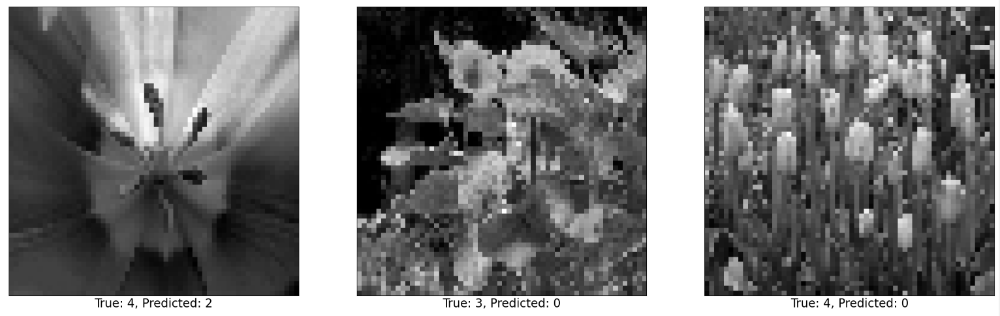

# CS4341_Project2 Write Up
Image classification using machine learning

### Model & Training Procedure Description 
1. Test 1
    - Data preprocessing implementation (i.e, shuffle or rotate data) : 
        *Flip* -> Random flip horizontal 
        *Rotations* -> random rotation of 0.3
    - ANN architectures (i.e, number of layers, number of neurons in each layer, type of activation function) :
        *Number of Layers* -> 22 layers
        *Number of Neurons by Layer* 
        - 1 x input layer
        - 1 x rescaling layer

        - 2 x convolution layer of 64 channel of 3x3 kernel and same padding.
        - 1 x maxpool layer of 2x2 pool size and stride 2x2.
        - 2 x convolution layer of 128 channel of 3x3 kernel and same padding.
        - 1 x maxpool layer of 2x2 pool size and stride 2x2.
        - 3 x convolution layer of 256 channel of 3x3 kernel and same padding.
        - 1 x maxpool layer of 2x2 pool size and stride 2x2.
        - 3 x convolution layer of 512 channel of 3x3 kernel and same padding.
        - 1 x maxpool layer of 2x2 pool size and stride 2x2.
        - 3 x convolution layer of 512 channel of 3x3 kernel and same padding.
        - 1 x maxpool layer of 2x2 pool size and stride 2x2.

        - 1 x Dense layer of 224 units with ReLU activation function
        - 1 x Dense Softmax layer of 5 units.

        *Activation Function* 
        - All convolutional layers utilize the ReLU activation function
    - Hyper-parameter value selection (i.e, the reshaped input image size, the type of optimizer, training epochs, and number of neurons or hidden_size or number of parameters, the loss function) :
        *Number of Training Epochs* -> 10 Epochs
        *Reshaped Image Size* -> (224, 224)
        *Type of Optimizer* -> Utilized the 'adam' optimizer
        *Number of Neurons* -> 224 hidden units
        *Loss Function* -> 'SparseCategoricalCrossentropy'
    - Accuracy you obtained in each of these experiments on the test set : 
        -> 24.06%

2. Test 2
    - Data preprocessing implementation (i.e, shuffle or rotate data) : 
        *Flip* -> Random flip horizontal 
        *Rotations* -> random rotation of 0.3
    - ANN architectures (i.e, number of layers, number of neurons in each layer, type of activation function) :
        *Number of Layers* -> 14 layers
        *Number of Neurons by Layer* 
        - 1 x input layer
        - 1 x rescaling layer

        - 1 x convolution layer of 32 channel of 3x3 kernel and same padding.
        - 1 x convolution layer of 64 channel of 3x3 kernel and same padding.
        - 1 x maxpool layer of 2x2 pool size and stride 2x2.
        - 1 x convolution layer of 64 channel of 3x3 kernel and same padding.
        - 1 x convolution layer of 128 channel of 3x3 kernel and same padding.
        - 1 x maxpool layer of 2x2 pool size and stride 2x2.
        - 1 x convolution layer of 128 channel of 3x3 kernel and same padding.
        - 1 x convolution layer of 256 channel of 3x3 kernel and same padding.
        - 1 x maxpool layer of 2x2 pool size and stride 2x2.
        - 1 x convolution layer of 256 channel of 3x3 kernel and same padding.
        - 1 x maxpool layer of 2x2 pool size and stride 2x2.

        - 1 x Dense layer of 224 units with ReLU activation function
        - 1 x Dense Softmax layer of 5 units.

        *Activation Function* 
        - All convolutional layers utilize the ReLU activation function
    - Hyper-parameter value selection (i.e, the reshaped input image size, the type of optimizer, training epochs, and number of neurons or hidden_size or number of parameters, the loss function) :
        *Number of Training Epochs* -> 20 Epochs
        *Reshaped Image Size* -> (224, 224)
        *Type of Optimizer* -> Utilized the 'adam' optimizer
        *Number of Neurons* -> 224 hidden units
        *Loss Function* -> 'SparseCategoricalCrossentropy'
    - Accuracy you obtained in each of these experiments on the test set : 
        -> 68.3%

3. Test 3
    - Data preprocessing implementation (i.e, shuffle or rotate data) : 
        *Flip* -> Random flip horizontal 
        *Rotations* -> random rotation of 0.3
    - ANN architectures (i.e, number of layers, number of neurons in each layer, type of activation function) :
        *Number of Layers* -> 16 layers
        *Number of Neurons by Layer* 
        - 1 x input layer
        - 1 x rescaling layer

        - 2 x convolution layer of 32 channel of 3x3 kernel and same padding.
        - 1 x maxpool layer of 2x2 pool size and stride 2x2.
        - 2 x convolution layer of 64 channel of 3x3 kernel and same padding.
        - 1 x maxpool layer of 2x2 pool size and stride 2x2.
        - 2 x convolution layer of 128 channel of 3x3 kernel and same padding.
        - 1 x maxpool layer of 2x2 pool size and stride 2x2.
        - 1 x convolution layer of 256 channel of 3x3 kernel and same padding.
        - 1 x maxpool layer of 2x2 pool size and stride 2x2.

        - 1 x Dense layer of 224 units with ReLU activation function
        - 1 x Dense Softmax layer of 5 units.

        *Activation Function* 
        - All convolutional layers utilize the ReLU activation function
    - Hyper-parameter value selection (i.e, the reshaped input image size, the type of optimizer, training epochs, and number of neurons or hidden_size or number of parameters, the loss function) :
        *Number of Training Epochs* -> 19 Epochs
        *Reshaped Image Size* -> (224, 224)
        *Type of Optimizer* -> Utilized the 'adam' optimizer
        *Number of Neurons* -> 224 hidden units
        *Loss Function* -> 'SparseCategoricalCrossentropy'
    - Accuracy you obtained in each of these experiments on the test set : 
        -> 75.2%

4. Additional tests
    *The following results used these preprocessing settings*

    *Flip* -> horizontal and vertical flip
    *Zoom* -> random zoom (0.2, 0.2)
    *rotations* -> random rotation (0.3)
    *shuffling* -> shuffle with buffer_size 5000

    1) 224 unit dense layer with sigmoid + 20 epochs -> 77%
    2) 224 unit dense layer with sigmoid + 30 epochs -> 74.7%
    3) 224 unit dense layer with sigmoid + 50 epochs -> 77.8%
    4) 224 unit dense layer with sigmoid and relu each + 20 epochs -> 75%
    5) 224 unit dense layer with sigmoid and relu each + 50 epochs -> 72% (badly overfitting)

5. Final Model
    - Data preprocessing implementation (i.e, shuffle or rotate data)
        *Flip* -> Random flip horizontal and vertical 
        *Shuffling* -> utilize shuffle() with a buffer size of 5000
        *Rotations* -> random rotation of 0.25
        *Zoom* -> Random zoom of (0.2, 0.2)
    - ANN architectures (i.e, number of layers, number of neurons in each layer, type of activation function)
        *Number of Layers* -> 16 layers
        *Number of Neurons by Layer* 
            - 2 x convolution layer of 32 channel of 3x3 kernel and same padding.
            - 1 x maxpool layer of 2x2 pool size and stride 2x2.
            - 2 x convolution layer of 64 channel of 3x3 kernel and same padding.
            - 1 x maxpool layer of 2x2 pool size and stride 2x2.
            - 2 x convolution layer of 128 channel of 3x3 kernel and same padding.
            - 1 x maxpool layer of 2x2 pool size and stride 2x2.
            - 1 x convolution layer of 256 channel of 3x3 kernel and same padding.

            - 1 x Dense layer of 224 units using sigmoid activation function.
            - 1 x Dense Softmax layer of 5 units.
        *Activation Function* 
            - The first dense layer utilizes the Sigmoid activation function
            - All convolutional layers utilize the ReLU activation function
    - Hyper-parameter value selection (i.e, the reshaped input image size, the type of optimizer, training epochs, and number of neurons or hidden_size or number of parameters, the loss function)
        *Number of Training Epochs* -> 70 Epochs
        *Reshaped Image Size* -> (224, 224)
        *Type of Optimizer* -> Utilized the 'adam' optimizer
        *Number of Neurons* -> 224 hidden units
        *Loss Function* -> 'SparseCategoricalCrossentropy'
    - Accuracy you obtained in each of these experiments on the test set : 
        -> 75.2%

### Model Performance & Confusion Matrix 
Include a section describing in more detail the most accurate model you were able to obtain: the ANN architecture of your model, including number of layers, number of neurons in each layer, activation function, number of epochs used for training, type of optimizer used for training, type of loss function used for training, values for other hyperparameters, and data preprocessing used. 
1. Final Model Details
    - Data preprocessing implementation (i.e, shuffle or rotate data)
        *Flip* -> Random flip horizontal and vertical 
        *Shuffling* -> utilize shuffle() with a buffer size of 5000
        *Rotations* -> random rotation of 0.25
        *Zoom* -> Random zoom of (0.2, 0.2)
    - ANN architectures (i.e, number of layers, number of neurons in each layer, type of activation function)
        *Number of Layers* -> 16 layers
        *Number of Neurons by Layer* 
            - 1 x input layer
            - 1 x rescaling layer

            - 2 x convolution layer of 32 channel of 3x3 kernel and same padding.
            - 1 x maxpool layer of 2x2 pool size and stride 2x2.
            - 2 x convolution layer of 64 channel of 3x3 kernel and same padding.
            - 1 x maxpool layer of 2x2 pool size and stride 2x2.
            - 2 x convolution layer of 128 channel of 3x3 kernel and same padding.
            - 1 x maxpool layer of 2x2 pool size and stride 2x2.
            - 1 x convolution layer of 256 channel of 3x3 kernel and same padding.

            - 1 x Dense layer of 224 units using sigmoid activation function.
            - 1 x Dense Softmax layer of 5 units.
        *Activation Function* 
            - The first dense layer utilizes the Sigmoid activation function
            - All convolutional layers utilize the ReLU activation function
    - Hyper-parameter value selection (i.e, the reshaped input image size, the type of optimizer, training epochs, and number of neurons or hidden_size or number of parameters, the loss function)
        *Number of Training Epochs* -> 20 Epochs
        *Reshaped Image Size* -> (224, 224)
        *Type of Optimizer* -> Utilized the 'adam' optimizer
        *Number of Neurons* -> 224 hidden units
        *Loss Function* -> 'SparseCategoricalCrossentropy'
    - Accuracy you obtained in each of these experiments on the test set : 
        -> 75.2%

Include a confusion matrix, showing the results of testing the model on the test set. The matrix should be a 5-by-5 grid showing which categories of images were classified. Use your confusion matrix to additionally report precision and recall for each of the 5 classes, as well as the overall accuracy of your model.  

### Training Performance Plot 

For your best-performing ANN, include a plot showing how training accuracy and validation accuracy change over time during training. Graph number of training epochs (x-axis) versus training set and validation set accuracy (y-axis). Hence, your plot should contain two curves.  

### Visualization 

Include 3 visualizations of images that were misclassified by your best-performing model and any observations about why you think these images were misclassified by your model. You will have to create or use a visualization program that takes a 30-by-30 matrix input and translate it into a black-and-white image. 

1. Image 1
2. Image 2
3. Image 3